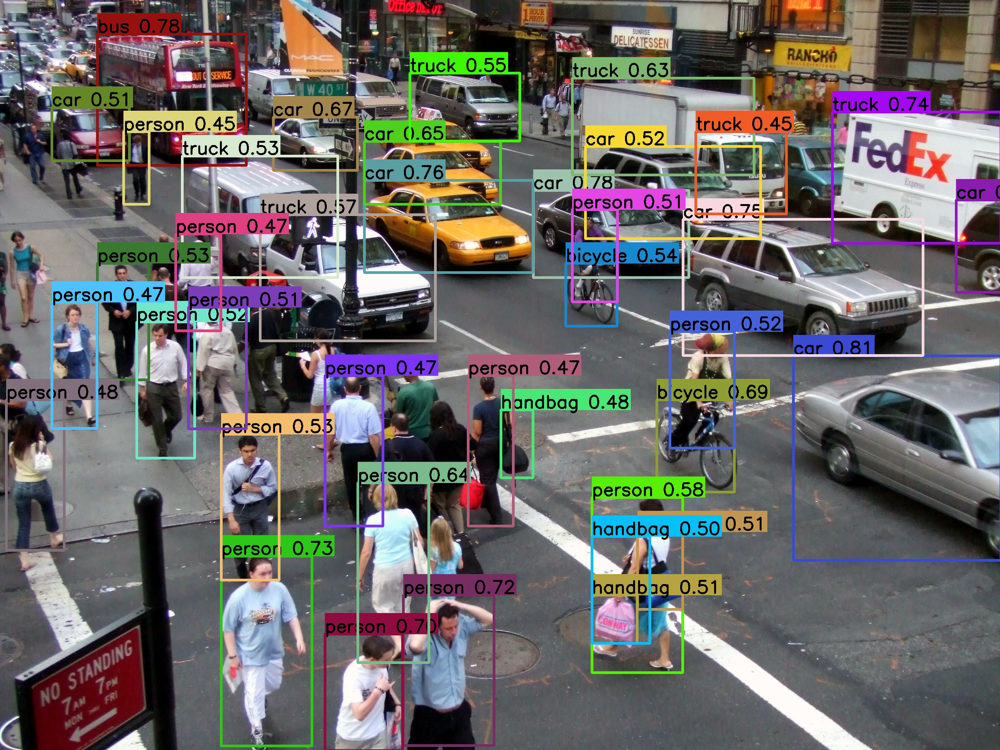

#  DAMO-YOLO (Object Detection)
This sample application demonstrates the execution of a converted [DAMO-YOLO](https://github.com/tinyvision/DAMO-YOLO) model using the ENN framework. The model is converted using **AI Studio 2.0** service.

## Functionality
This sample application identifies objects in an input image/video file.
The detected objects are highlighted with bounding boxes, and the label and score of each object are displayed.

        

## Location
The sample is available in the `enn-sdk-samples-v920/Object-Detection/DAMO-YOLO` directory within the [Github](https://github.com/exynos-eco/enn-sdk-samples-v920-linux) repository.

## Getting Started
### Build Instructions
1.	Clone or download this sample application from the repository.
2.	Install the **EA-SDK** required for building.
3.	Set the path to the **EA-SDK** inside the build.sh script.
4.  Connect the **SADK (V920)** board to the PC via a USB cable.
5.	On the device, run the following script to enable ADB:
    ```bash
    /home/root/adb.sh
    ```
6.	Execute the build script:
    ```bash
    ./build.sh
    ```
### Push Required Files to Device
1.	Connect the device to the PC via a USB cable.
2.	On the device, run the following script to enable ADB:
    ```bash
    /home/root/adb.sh
    ```
3.	On the PC, run the following script to push necessary files to the device:
    ```bash
    ./push_extrafiles.sh
    ```

### Run the Application
1. To enable screen output, run the following command on the device:

    ```bash
    /data/vendor/damoyolo/weston_setup.sh
    ```

2. Execute the following command on the device (via UART or ADB shell):

    ```bash
    /data/vendor/damoyolo/enn_sample_damoyolo -m /data/vendor/damoyolo/damoyolo_tinynasL25_S_460_simplify_O2_MultiCore.nnc -i /data/vendor/damoyolo/media/video.mp4
    ```
    ##### Command-line Options
    - `-m` : Path to the input model file (.nnc format)  
            e.g. `/data/vendor/damoyolo/damoyolo_tinynasL25_S_460_simplify_O2_MultiCore.nnc`

    - `-i` : Path to the input media file (image or video)  
            e.g. `/data/vendor/damoyolo/media/video.mp4`