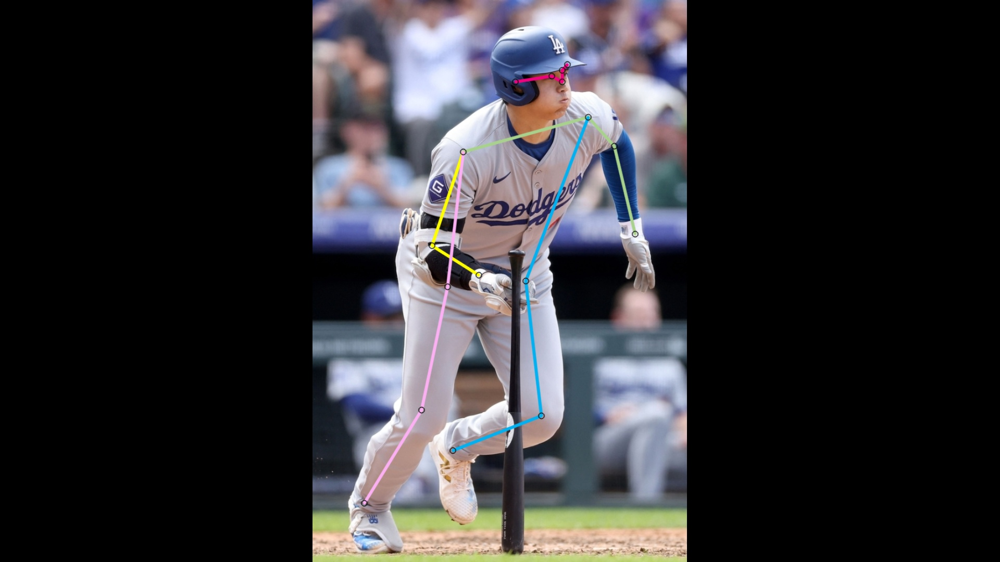
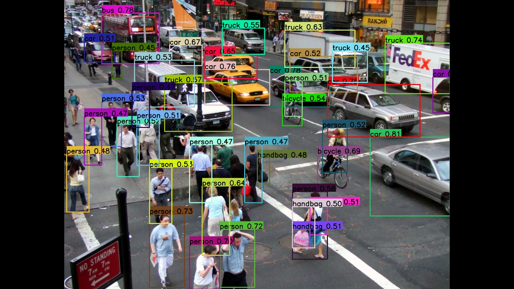
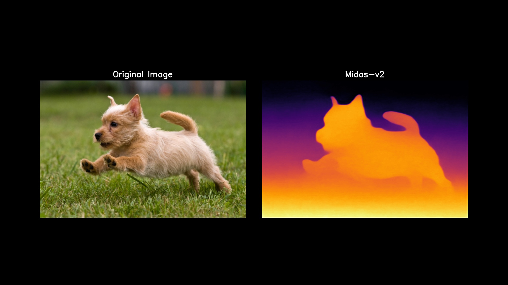
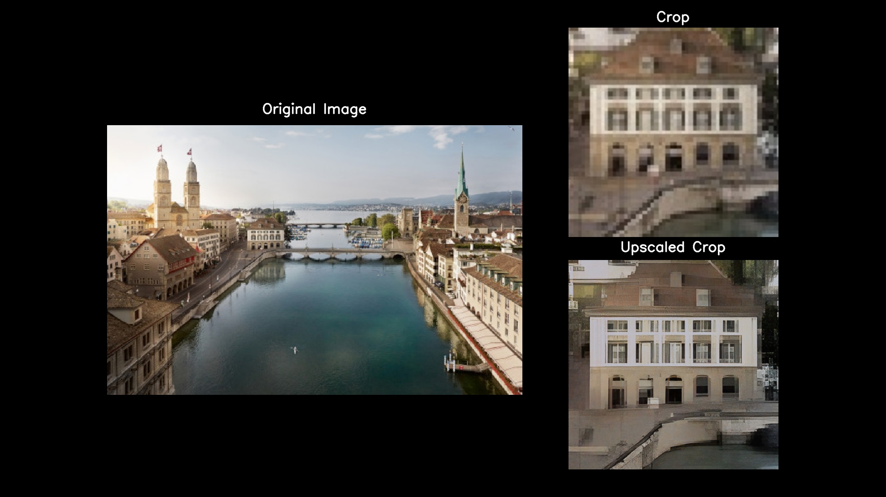
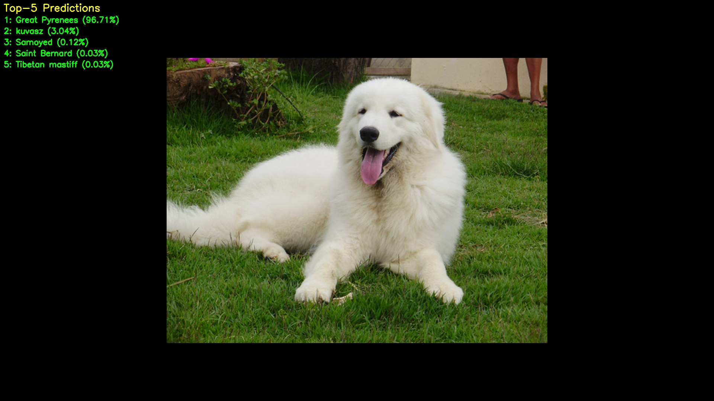

# ENN SDK Samples v920 Linux

## Introduction
| Category | Model | Description | Thumbnail |
|:---:|---|---|:---:|
| [**Pose&nbsp;Estimation**](#pose-estimation) | [HRNet](Pose-Estimation/HRNet/README.md) | Detects and tracks human or object keypoints to estimate body posture and motion. |  |
| [**Object&nbsp;Detection**](#object-detection) | [DAMO-YOLO](Object-Dectection/DAMO-YOLO/README.md) | Identifies and localizes multiple objects within an image or video frame. |  |
| [**Depth&nbsp;Estimation**](#depth-estimation) | [Midas-V2](Depth-Estimation/Midas-V2/README.md) | Predicts relative distance information from a single image to generate a depth map. |  |
| [**Super&nbsp;Resolution**](#super-resolution) | [Real-ESRGAN-x4plus](Super-Resolution/Real-ESRGAN-x4plus/README.md) | Enhances image resolution by restoring fine details and producing sharper visuals. |  |
| [**Image&nbsp;Classification**](#image-classification) | [DenseNet-121](Image-Classification/DenseNet-121/README.md), [GoogLeNet](Image-Classification/DenseNet-121/README.md), [Inception-v3](Image-Classification/DenseNet-121/README.md), [MNASNet05](Image-Classification/DenseNet-121/README.md), [RegNet](Image-Classification/DenseNet-121/README.md), [ResNet18](Image-Classification/DenseNet-121/README.md), [ResNet50](Image-Classification/DenseNet-121/README.md), [ResNeXt50](Image-Classification/DenseNet-121/README.md), [ResNeXt101](Image-Classification/DenseNet-121/README.md), [SqueezeNet-1.1](Image-Classification/DenseNet-121/README.md), [WideResNet50](Image-Classification/DenseNet-121/README.md) | Analyzes an image to determine the most probable object or scene category. |  |


## Linux Samples
This section provides an overview of Linux sample applications.
Each category below introduces models optimized for Exynos hardware using the ENN SDK.

***

### Pose-Estimation
Models designed to detect and track keypoints for human pose and motion analysis.

| Model | Description |
|-------|-------------|
| [**HRNet**](Pose-Estimation/HRNet/README.md) | High-Resolution Network that maintains high-resolution feature maps for accurate human pose estimation. |

#### Functionality
The application accepts input from an image or video file, detects human keypoints, and overlays skeletal lines for visualization.

#### Location
`enn-sdk-samples-v920-linux/Pose-Estimation`

[⬆️ Back to top](#introduction)

***

### Object-Detection
Models designed to identify and localize multiple objects within an image or video frame.

| Model | Description |
|-------|-------------|
| [**DAMO&#8209;YOLO**](Object-Dectection/DAMO-YOLO/README.md) | An efficient object detection model optimized for real-time inference with balanced accuracy and computation. |

#### Functionality
This application detects objects in input media and displays bounding boxes with class labels and confidence scores.

#### Location
`enn-sdk-samples-v920-linux/Object-Dectection`

[⬆️ Back to top](#introduction)

***

### Depth-Estimation
Models designed to infer per-pixel depth information from a single image.

| Model | Description |
|-------|-------------|
| [**Midas-V2**](Depth-Estimation/Midas-V2/README.md) | A monocular depth estimation model that infers detailed relative depth maps from a single image. |

#### Functionality
This sample estimates the depth of input images or frames, generating maps where closer objects appear brighter.

#### Location
`enn-sdk-samples-v920-linux/Depth-Estimation`

[⬆️ Back to top](#introduction)

***

### Super-Resolution
Models designed to enhance visual quality by upscaling and refining low-resolution images.

| Model | Description |
|---|---|
| [**Real&#8209;ESRGAN&#8209;x4plus**](Super-Resolution/Real-ESRGAN-x4plus/README.md) | A super-resolution model that enhances image quality by upscaling 4× and removing noise and artifacts. |

#### Functionality
This application upscales input images, reconstructing high-frequency details for sharper and more natural visuals.

#### Location
`enn-sdk-samples-v920-linux/Super-Resolution`

[⬆️ Back to top](#introduction)

***

### Image-Classification
Models designed to analyze input images and classify them into predefined categories.

| Model | Description |
|--------|-------------|
| [**DenseNet-121**](Image-Classification/DenseNet-121/README.md) | CNN with dense connections between layers, improving feature reuse and gradient efficiency. |
| [**GoogLeNet**](Image-Classification/DenseNet-121/README.md) | Early Inception model using parallel convolutions of different sizes for efficient image classification. |
| [**Inception-v3**](Image-Classification/DenseNet-121/README.md) | Enhanced Inception architecture with factorized convolutions for higher accuracy and lower computation cost. |
| [**MNASNet05**](Image-Classification/DenseNet-121/README.md) | Lightweight CNN discovered via Neural Architecture Search, optimized for efficient inference. |
| [**RegNet**](Image-Classification/DenseNet-121/README.md) | Scalable CNN family designed with simple, regular design rules for balanced accuracy and efficiency. |
| [**ResNet18**](Image-Classification/DenseNet-121/README.md) | 18-layer residual network with skip connections, enabling deeper yet lightweight training. |
| [**ResNet50**](Image-Classification/DenseNet-121/README.md) | 50-layer residual network widely used as a standard backbone for image classification tasks. |
| [**ResNeXt50**](Image-Classification/DenseNet-121/README.md) | Improved ResNet variant using grouped convolutions for better accuracy and efficiency. |
| [**ResNeXt101**](Image-Classification/DenseNet-121/README.md) | Deeper version of ResNeXt combining multi-branch and grouped convolutions for strong performance. |
| [**SqueezeNet&#8209;1.1**](Image-Classification/DenseNet-121/README.md) | Extremely compact CNN achieving AlexNet-level accuracy with far fewer parameters. |
| [**WideResNet50**](Image-Classification/DenseNet-121/README.md) | Wider ResNet variant offering higher capacity and improved accuracy with minimal complexity. |

#### Functionality
This application performs image classification by analyzing input images and predicting the most likely object categories.

#### Location
`enn-sdk-samples-v920-linux/Image-Classification`

[⬆️ Back to top](#introduction)

***

### Troubleshooting
#### [Display Fix] Adjust GStreamer sink for correct on-screen alignment

If you observe the output window shifted or cropped on Wayland systems,  
you need to update the GStreamer pipeline inside `[Model_name].cc`.

**File to modify:**  
`src/[Model_name].cc` (inside `namespace GStreamerDisplay` -> `initialize()`)

**Change this line:**
```cpp
        pipeline = gst_parse_launch(
            "appsrc name=mysource is-live=true block=true format=time ! "
            "videoconvert ! "
            "videoscale ! "
            "video/x-raw,width=1920,height=1080 ! "
            "autovideosink sync=false", &error);

To this:
        pipeline = gst_parse_launch(
            "appsrc name=mysource is-live=true block=true format=time ! "
            "videoconvert ! "
            "videoscale ! "
            "video/x-raw,width=1920,height=1080 ! "
            "waylandsink sync=false", &error);
